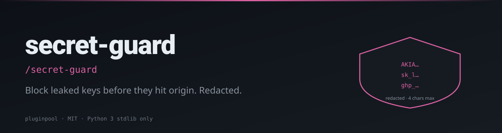

# secret-guard

**Block leaked API keys before they hit `origin`. Pattern + entropy. Redacted output.**

[](./LICENSE)
[](https://www.python.org/)
[](https://docs.claude.com/en/docs/claude-code/overview)
[](./tests)

> **TL;DR:** `/secret-guard` → scans your staged diff for AWS / GitHub / Slack / Stripe / Google API keys, JWTs, private keys, and high-entropy base64 strings. Blocks the commit before the secret leaves your machine.

#### Writing

**LinkedIn**
- 🗡️ [Çift Yüzlü Katana: Yapay Zeka Dönüşümlerinin Gerçekçi Bir Analizi](https://www.linkedin.com/pulse/%C3%A7ift-y%C3%BCzl%C3%BC-katana-yapay-zeka-d%C3%B6n%C3%BC%C5%9F%C3%BCmlerinin-ger%C3%A7ek%C3%A7i-bir-mehmet-turac-80h7f) — AI transformations realistic analysis. The 5 illusions that compound into expensive, fragile systems.
- 📄 [LinkedIn Articles](https://www.linkedin.com/in/mehmetturac/recent-activity/articles/) — All published articles
- 📊 [LinkedIn Documents](https://www.linkedin.com/in/mehmetturac/recent-activity/documents/) — Research papers and technical documents

**Dev.to**
- [Why AI Agents Fail?](https://dev.to/turacthethinker/why-ai-agents-fail-ddg)
- [We Ship to Production Without Tests. Here's How It Destroyed Us.](https://dev.to/turacthethinker/we-ship-to-production-without-tests-heres-how-it-destroyed-us-i4i)
- [I built a product in one AI session. Here's the system that made it ship right.](https://dev.to/turacthethinker/i-built-a-product-in-one-ai-session-heres-the-system-that-made-it-ship-right-3mb3)
- [Remote Work Didn't Break Productivity — It Broke Human Connection](https://dev.to/turacthethinker/remote-work-didnt-break-productivity-it-broke-human-connection-288o)
- [Hermes vs OpenClaw: Which AI assistant would you actually trust?](https://dev.to/turacthethinker/hermes-vs-openclaw-which-ai-assistant-would-you-actually-trust-bbl)
- [Strategic LLM Adoption: A Director's Guide to Fine-Tuning Models](https://dev.to/turacthethinker/strategic-llm-adoption-a-directors-guide-to-fine-tuning-models-for-domain-specific-applications-4e37)
- [The Context Window Lie: Why Your LLM Remembers Nothing](https://dev.to/turacthethinker/the-context-window-lie-why-your-llm-remembers-nothing-5h1p)
- [Stop Your AI Agent From Building Tools That Already Exist](https://dev.to/turacthethinker/stop-your-ai-agent-from-building-tools-that-already-exist-6o9)
- [Why Versioned SQL Beats Vector RAG for Agent Memory Systems](https://dev.to/turacthethinker/why-versioned-sql-beats-vector-rag-for-agent-memory-systems-1jo3)
- [I Got Access to 136 AI Models for Free — NVIDIA NIM API Deep Dive](https://dev.to/turacthethinker/i-got-access-to-136-ai-models-for-free-nvidia-nim-api-deep-dive-111o)
- [Your Agent Isn't Reflecting. It's Performing Reflection.](https://dev.to/turacthethinker/your-agent-isnt-reflecting-its-performing-reflection-b41)
- [How I Stopped My AI Agent From Reinventing the Wheel](https://dev.to/turacthethinker/how-i-stopped-my-ai-agent-from-reinventing-the-wheel-24eo)


#### Writing

- ✍️ [**Dev.to · TuracTheThinker**](https://dev.to/turacthethinker) — Technical articles on AI, agentic systems, and production engineering
- 📄 [**LinkedIn Articles**](https://www.linkedin.com/in/mehmetturac/recent-activity/articles/) — Industry insights and analysis
- 📊 [**LinkedIn Documents**](https://www.linkedin.com/in/mehmetturac/recent-activity/documents/) — Research papers and technical documents

- 🗡️ [**Çift Yüzlü Katana: Yapay Zeka Dönüşümlerinin Gerçekçi Bir Analizi**](https://www.linkedin.com/pulse/%C3%A7ift-y%C3%BCzl%C3%BC-katana-yapay-zeka-d%C3%B6n%C3%BC%C5%9F%C3%BCmlerinin-ger%C3%A7ek%C3%A7i-bir-mehmet-turac-80h7f) — AI transformations realistic analysis. The 5 illusions that compound into expensive, fragile systems. (LinkedIn, 2026)


## Install (Claude Code + pre-commit)

```sh
git clone https://github.com/mturac/pluginpool-secret-guard ~/.claude/plugins/secret-guard
```

To wire as a pre-commit hook:

```sh
cp ~/.claude/plugins/secret-guard/hooks/pre-commit .git/hooks/pre-commit
chmod +x .git/hooks/pre-commit
```

#### Writing

- ✍️ [**Dev.to · TuracTheThinker**](https://dev.to/turacthethinker) — Technical articles on AI, agentic systems, and production engineering
- 📄 [**LinkedIn Articles**](https://www.linkedin.com/in/mehmetturac/recent-activity/articles/) — Industry insights and analysis
- 📊 [**LinkedIn Documents**](https://www.linkedin.com/in/mehmetturac/recent-activity/documents/) — Research papers and technical documents

- 🗡️ [**Çift Yüzlü Katana: Yapay Zeka Dönüşümlerinin Gerçekçi Bir Analizi**](https://www.linkedin.com/pulse/%C3%A7ift-y%C3%BCzl%C3%BC-katana-yapay-zeka-d%C3%B6n%C3%BC%C5%9F%C3%BCmlerinin-ger%C3%A7ek%C3%A7i-bir-mehmet-turac-80h7f) — AI transformations realistic analysis. The 5 illusions that compound into expensive, fragile systems. (LinkedIn, 2026)


## Quick start

```sh
/secret-guard                                            # scan staged diff
python3 scripts/guard.py                                 # same, directly
python3 scripts/guard.py --files src/config.py .env      # scan specific files
python3 scripts/guard.py --allowlist .secretignore       # suppress known false positives
```

#### Writing

- ✍️ [**Dev.to · TuracTheThinker**](https://dev.to/turacthethinker) — Technical articles on AI, agentic systems, and production engineering
- 📄 [**LinkedIn Articles**](https://www.linkedin.com/in/mehmetturac/recent-activity/articles/) — Industry insights and analysis
- 📊 [**LinkedIn Documents**](https://www.linkedin.com/in/mehmetturac/recent-activity/documents/) — Research papers and technical documents

- 🗡️ [**Çift Yüzlü Katana: Yapay Zeka Dönüşümlerinin Gerçekçi Bir Analizi**](https://www.linkedin.com/pulse/%C3%A7ift-y%C3%BCzl%C3%BC-katana-yapay-zeka-d%C3%B6n%C3%BC%C5%9F%C3%BCmlerinin-ger%C3%A7ek%C3%A7i-bir-mehmet-turac-80h7f) — AI transformations realistic analysis. The 5 illusions that compound into expensive, fragile systems. (LinkedIn, 2026)


## Flags

| Flag | Default | Description |
|---|---|---|
| `--files F…` | _staged diff_ | Scan specific files instead of the staged diff |
| `--allowlist PATH` | _none_ | Regexes (one per line) that suppress matching findings |
| `--format` | `json` | `json` or `md` |

#### Writing

- ✍️ [**Dev.to · TuracTheThinker**](https://dev.to/turacthethinker) — Technical articles on AI, agentic systems, and production engineering
- 📄 [**LinkedIn Articles**](https://www.linkedin.com/in/mehmetturac/recent-activity/articles/) — Industry insights and analysis
- 📊 [**LinkedIn Documents**](https://www.linkedin.com/in/mehmetturac/recent-activity/documents/) — Research papers and technical documents

- 🗡️ [**Çift Yüzlü Katana: Yapay Zeka Dönüşümlerinin Gerçekçi Bir Analizi**](https://www.linkedin.com/pulse/%C3%A7ift-y%C3%BCzl%C3%BC-katana-yapay-zeka-d%C3%B6n%C3%BC%C5%9F%C3%BCmlerinin-ger%C3%A7ek%C3%A7i-bir-mehmet-turac-80h7f) — AI transformations realistic analysis. The 5 illusions that compound into expensive, fragile systems. (LinkedIn, 2026)


## Detected patterns

| Rule | Match |
|---|---|
| AWS Access Key ID | `AKIA[0-9A-Z]{16}` |
| GitHub PAT | `gh[pousr]_[A-Za-z0-9]{36,}` |
| Slack token | `xox[abpr]-[A-Za-z0-9-]{10,}` |
| Stripe key | `sk_(live|test)_[A-Za-z0-9]{24,}` |
| Google API key | `AIza[0-9A-Za-z_-]{35}` |
| JWT | `eyJ…\.eyJ…\.…` |
| Private key | `-----BEGIN … PRIVATE KEY-----` |
| Generic high-entropy | base64-ish ≥32 chars, Shannon entropy ≥ 4.5 |

#### Writing

- ✍️ [**Dev.to · TuracTheThinker**](https://dev.to/turacthethinker) — Technical articles on AI, agentic systems, and production engineering
- 📄 [**LinkedIn Articles**](https://www.linkedin.com/in/mehmetturac/recent-activity/articles/) — Industry insights and analysis
- 📊 [**LinkedIn Documents**](https://www.linkedin.com/in/mehmetturac/recent-activity/documents/) — Research papers and technical documents

- 🗡️ [**Çift Yüzlü Katana: Yapay Zeka Dönüşümlerinin Gerçekçi Bir Analizi**](https://www.linkedin.com/pulse/%C3%A7ift-y%C3%BCzl%C3%BC-katana-yapay-zeka-d%C3%B6n%C3%BC%C5%9F%C3%BCmlerinin-ger%C3%A7ek%C3%A7i-bir-mehmet-turac-80h7f) — AI transformations realistic analysis. The 5 illusions that compound into expensive, fragile systems. (LinkedIn, 2026)


## Example output (markdown)

```
# secret-guard report

| file | line | rule | snippet |
|---|---|---|---|
| src/config.py | 12 | aws-access-key | AKIA… |
| .env | 4 | stripe-key | sk_l… |
```

Note: snippets are always `rule + first 4 chars + …` — never the full secret.

#### Writing

- ✍️ [**Dev.to · TuracTheThinker**](https://dev.to/turacthethinker) — Technical articles on AI, agentic systems, and production engineering
- 📄 [**LinkedIn Articles**](https://www.linkedin.com/in/mehmetturac/recent-activity/articles/) — Industry insights and analysis
- 📊 [**LinkedIn Documents**](https://www.linkedin.com/in/mehmetturac/recent-activity/documents/) — Research papers and technical documents

- 🗡️ [**Çift Yüzlü Katana: Yapay Zeka Dönüşümlerinin Gerçekçi Bir Analizi**](https://www.linkedin.com/pulse/%C3%A7ift-y%C3%BCzl%C3%BC-katana-yapay-zeka-d%C3%B6n%C3%BC%C5%9F%C3%BCmlerinin-ger%C3%A7ek%C3%A7i-bir-mehmet-turac-80h7f) — AI transformations realistic analysis. The 5 illusions that compound into expensive, fragile systems. (LinkedIn, 2026)


## Exit codes

| Code | Meaning |
|---|---|
| `0` | Clean — no secrets found |
| `1` | At least one finding (commit is blocked when used as a hook) |

#### Writing

- ✍️ [**Dev.to · TuracTheThinker**](https://dev.to/turacthethinker) — Technical articles on AI, agentic systems, and production engineering
- 📄 [**LinkedIn Articles**](https://www.linkedin.com/in/mehmetturac/recent-activity/articles/) — Industry insights and analysis
- 📊 [**LinkedIn Documents**](https://www.linkedin.com/in/mehmetturac/recent-activity/documents/) — Research papers and technical documents

- 🗡️ [**Çift Yüzlü Katana: Yapay Zeka Dönüşümlerinin Gerçekçi Bir Analizi**](https://www.linkedin.com/pulse/%C3%A7ift-y%C3%BCzl%C3%BC-katana-yapay-zeka-d%C3%B6n%C3%BC%C5%9F%C3%BCmlerinin-ger%C3%A7ek%C3%A7i-bir-mehmet-turac-80h7f) — AI transformations realistic analysis. The 5 illusions that compound into expensive, fragile systems. (LinkedIn, 2026)


## Safety guarantees

- `test_redaction_contains_only_rule_and_first_four` asserts the raw secret never appears in JSON or markdown output.
- `test_files_mode_does_not_crash_on_non_utf8` ensures non-UTF-8 / binary files are skipped, not crashed on.

#### Writing

- ✍️ [**Dev.to · TuracTheThinker**](https://dev.to/turacthethinker) — Technical articles on AI, agentic systems, and production engineering
- 📄 [**LinkedIn Articles**](https://www.linkedin.com/in/mehmetturac/recent-activity/articles/) — Industry insights and analysis
- 📊 [**LinkedIn Documents**](https://www.linkedin.com/in/mehmetturac/recent-activity/documents/) — Research papers and technical documents

- 🗡️ [**Çift Yüzlü Katana: Yapay Zeka Dönüşümlerinin Gerçekçi Bir Analizi**](https://www.linkedin.com/pulse/%C3%A7ift-y%C3%BCzl%C3%BC-katana-yapay-zeka-d%C3%B6n%C3%BC%C5%9F%C3%BCmlerinin-ger%C3%A7ek%C3%A7i-bir-mehmet-turac-80h7f) — AI transformations realistic analysis. The 5 illusions that compound into expensive, fragile systems. (LinkedIn, 2026)


## Limitations

- Pattern lists drift; submit PRs for new providers.
- Entropy heuristic produces some false positives on minified bundles — use `--allowlist` to suppress.
- Doesn't scan repo history; pair with `git-secrets` or `trufflehog` for that.

#### Writing

- ✍️ [**Dev.to · TuracTheThinker**](https://dev.to/turacthethinker) — Technical articles on AI, agentic systems, and production engineering
- 📄 [**LinkedIn Articles**](https://www.linkedin.com/in/mehmetturac/recent-activity/articles/) — Industry insights and analysis
- 📊 [**LinkedIn Documents**](https://www.linkedin.com/in/mehmetturac/recent-activity/documents/) — Research papers and technical documents

- 🗡️ [**Çift Yüzlü Katana: Yapay Zeka Dönüşümlerinin Gerçekçi Bir Analizi**](https://www.linkedin.com/pulse/%C3%A7ift-y%C3%BCzl%C3%BC-katana-yapay-zeka-d%C3%B6n%C3%BC%C5%9F%C3%BCmlerinin-ger%C3%A7ek%C3%A7i-bir-mehmet-turac-80h7f) — AI transformations realistic analysis. The 5 illusions that compound into expensive, fragile systems. (LinkedIn, 2026)


## Examples

Step-by-step walkthroughs with real input fixtures and the helper's actual output live in [`examples/`](./examples/README.md). Three or four scenarios per plugin — from the happy path to the edge cases the test suite guards.

#### Writing

- ✍️ [**Dev.to · TuracTheThinker**](https://dev.to/turacthethinker) — Technical articles on AI, agentic systems, and production engineering
- 📄 [**LinkedIn Articles**](https://www.linkedin.com/in/mehmetturac/recent-activity/articles/) — Industry insights and analysis
- 📊 [**LinkedIn Documents**](https://www.linkedin.com/in/mehmetturac/recent-activity/documents/) — Research papers and technical documents

- 🗡️ [**Çift Yüzlü Katana: Yapay Zeka Dönüşümlerinin Gerçekçi Bir Analizi**](https://www.linkedin.com/pulse/%C3%A7ift-y%C3%BCzl%C3%BC-katana-yapay-zeka-d%C3%B6n%C3%BC%C5%9F%C3%BCmlerinin-ger%C3%A7ek%C3%A7i-bir-mehmet-turac-80h7f) — AI transformations realistic analysis. The 5 illusions that compound into expensive, fragile systems. (LinkedIn, 2026)


## Part of the pluginpool family

Ten focused Claude Code plugins for everyday productivity:
[commit-narrator](https://github.com/mturac/pluginpool-commit-narrator) ·
[pr-storyteller](https://github.com/mturac/pluginpool-pr-storyteller) ·
[test-gap](https://github.com/mturac/pluginpool-test-gap) ·
[deps-doctor](https://github.com/mturac/pluginpool-deps-doctor) ·
[env-lint](https://github.com/mturac/pluginpool-env-lint) ·
[secret-guard](https://github.com/mturac/pluginpool-secret-guard) ·
[standup-gen](https://github.com/mturac/pluginpool-standup-gen) ·
[todo-harvest](https://github.com/mturac/pluginpool-todo-harvest) ·
[flaky-detector](https://github.com/mturac/pluginpool-flaky-detector) ·
[changelog-forge](https://github.com/mturac/pluginpool-changelog-forge)

#### Writing

- ✍️ [**Dev.to · TuracTheThinker**](https://dev.to/turacthethinker) — Technical articles on AI, agentic systems, and production engineering
- 📄 [**LinkedIn Articles**](https://www.linkedin.com/in/mehmetturac/recent-activity/articles/) — Industry insights and analysis
- 📊 [**LinkedIn Documents**](https://www.linkedin.com/in/mehmetturac/recent-activity/documents/) — Research papers and technical documents

- 🗡️ [**Çift Yüzlü Katana: Yapay Zeka Dönüşümlerinin Gerçekçi Bir Analizi**](https://www.linkedin.com/pulse/%C3%A7ift-y%C3%BCzl%C3%BC-katana-yapay-zeka-d%C3%B6n%C3%BC%C5%9F%C3%BCmlerinin-ger%C3%A7ek%C3%A7i-bir-mehmet-turac-80h7f) — AI transformations realistic analysis. The 5 illusions that compound into expensive, fragile systems. (LinkedIn, 2026)


## License

MIT — see [`LICENSE`](./LICENSE). Contributions welcome.
